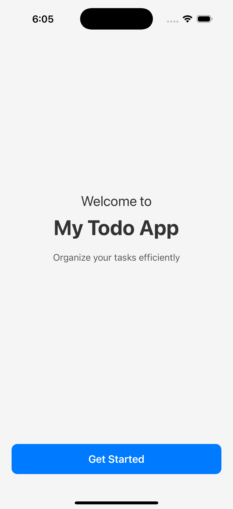
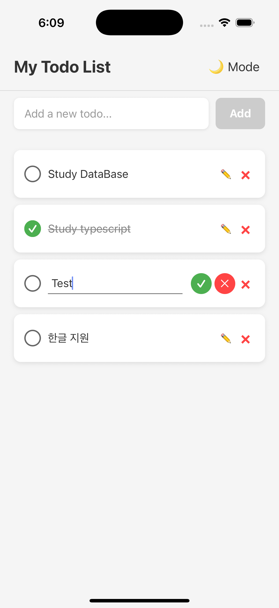
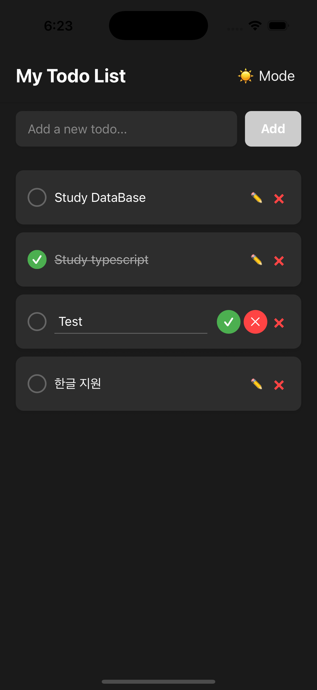
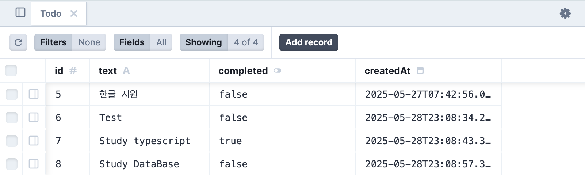

# Todo Application

A full-stack Todo application built with React Native (Expo) for the frontend and Node.js/Express (Prisma) for the backend.

## Demo

- Backend API: [https://to-do-app2025-da306b18cca9.herokuapp.com/todos](https://to-do-app2025-da306b18cca9.herokuapp.com/todos)

## Environment Variables

Example `.env` file:
```
API_URL=https://to-do-app2025-da306b18cca9.herokuapp.com/todos
```

## Deployment & Troubleshooting

- The backend is deployed on Heroku.
- The frontend is built with Expo and tested on TestFlight (or Play Store).
- If network requests fail on iOS/Android, check .env, build cache, Info.plist, CORS, HTTPS, and other related settings.
- Used console.log to verify that API_URL is correctly set at runtime on real devices.
- Verified the `/todos` endpoint on the Heroku server directly via browser/Safari.

## Experienced errors:

- **1. Cannot GET /**  
  A: The API server only provides the /todos endpoint. Accessing / will return 404 or "Cannot GET /"—this is expected.
- **2. Network requests from the app are not working**  
  A: Checked .env's API_URL, build cache, network environment, Info.plist, and CORS settings. eas.
  
- **3. API requests work in the simulator but not on a real device**  
  A: Double-check the .env at build time, app cache/install issues, network permissions, Info.plist settings, and ensure you are using an HTTPS address. Added API_URL directly to the eas.json file to force the build environment variable.

## Features

- Create, read, update, and delete todos
- Mark todos as complete/incomplete
- Real-time updates
- Clean and intuitive user interface
- Cross-platform support (iOS, Android)

## Screenshots

### Start page


### Main Todo List & Add New Todo & Edit Todo
<table>
<tr>
<td>

</td>
<td>

</td>
</tr>
</table>

*Main screen: You can view and manage your to-do list.*

### Database Management (Prisma Studio)_before deployment


*Prisma Studio for database management*

## Prerequisites

Before you begin, ensure you have the following installed:
- Node.js (v14 or higher)
- npm or yarn
- Expo CLI (`npm install -g expo-cli`)
- iOS Simulator (for Mac) or Android Studio (for Android development)

## Project Structure

```
to-do-app/
├── todo-frontend/     # React Native (Expo) frontend
└── todo-backend/      # Node.js/Express backend with Prisma
```

## Getting Started

### Backend Setup

1. Navigate to the backend directory:
   ```bash
   cd todo-backend
   ```

2. Install dependencies:
   ```bash
   npm install
   ```

3. Set up your database and update the Prisma schema if needed:
   ```bash
   npx prisma generate
   ```

4. Start the backend server:
   ```bash
   npm run dev
   ```

### Frontend Setup

1. Navigate to the frontend directory:
   ```bash
   cd todo-frontend
   ```

2. Install dependencies:
   ```bash
   npm install
   ```

3. Start the Expo development server:
   ```bash
   npm start
   ```

4. Use the Expo Go app on your mobile device or an emulator to run the application.

## Tech Stack

### Frontend
- React Native
- Expo
- TypeScript
- React Context for state management
- Custom hooks for API integration

### Backend
- Node.js
- Express
- Prisma (ORM)
- TypeScript

## API Endpoints

The backend provides the following RESTful API endpoints:

- `GET /api/todos` - Get all todos
- `POST /api/todos` - Create a new todo
- `PUT /api/todos/:id` - Update a todo
- `DELETE /api/todos/:id` - Delete a todo

## Contributing

1. Fork the repository
2. Create your feature branch (`git checkout -b feature/AmazingFeature`)
3. Commit your changes (`git commit -m 'Add some AmazingFeature'`)
4. Push to the branch (`git push origin feature/AmazingFeature`)
5. Open a Pull Request

## License

This project is licensed under the MIT License - see the LICENSE file for details.

## Project Learnings & Future Plans

<table>
<tr>
<td width="50%" valign="top">

### What I Learned
- React Native와 Expo를 사용한 모바일 앱 개발 경험
- TypeScript를 활용한 타입 안정성 확보
- Prisma를 통한 데이터베이스 관리와 ORM 사용법
- React Context를 활용한 상태 관리 구현
- Express.js를 사용한 RESTful API 설계와 구현
- 프론트엔드와 백엔드의 통신 구조 이해

### Challenges & Solutions
- 모바일 앱의 상태 관리: React Context를 도입하여 전역 상태 관리 구현
- 타입 안정성: TypeScript를 활용하여 컴파일 타임에 타입 체크
- API 설계: RESTful 원칙을 준수하여 일관된 API 구조 설계
- 데이터베이스 스키마: Prisma를 통해 타입 안전한 데이터베이스 스키마 관리

### Future Improvements
- 사용자 인증 시스템 추가 (JWT, OAuth)
- 실시간 업데이트 기능 구현 (WebSocket)
- 테스트 코드 작성 (Jest, React Testing Library)
- CI/CD 파이프라인 구축
- 성능 최적화 및 코드 리팩토링
- 다크 모드 지원
- 오프라인 지원 기능 추가

</td>
<td width="50%" valign="top">

### What I Learned
- Mobile app development experience using React Native and Expo
- Type safety implementation with TypeScript
- Database management and ORM usage with Prisma
- State management implementation using React Context
- RESTful API design and implementation with Express.js
- Understanding of frontend-backend communication structure

### Challenges & Solutions
- State Management: Implemented global state management using React Context
- Type Safety: Utilized TypeScript for compile-time type checking
- API Design: Designed consistent API structure following RESTful principles
- Database Schema: Managed type-safe database schema through Prisma

### Future Improvements
- User authentication system implementation (JWT, OAuth)
- Real-time update feature using WebSocket
- Test code implementation (Jest, React Testing Library)
- CI/CD pipeline setup
- Performance optimization and code refactoring
- Dark mode support
- Offline support feature

</td>
</tr>
</table> 